# FriendlyFriend-Social-Network-API

This is an API for the backend of a Social Network. As it is just an API it requires a tool to test the routes that interact with the database.

In this case I'll be using Insomnia to do so.

## User Routes

### /api/users GET

This route returns all users.
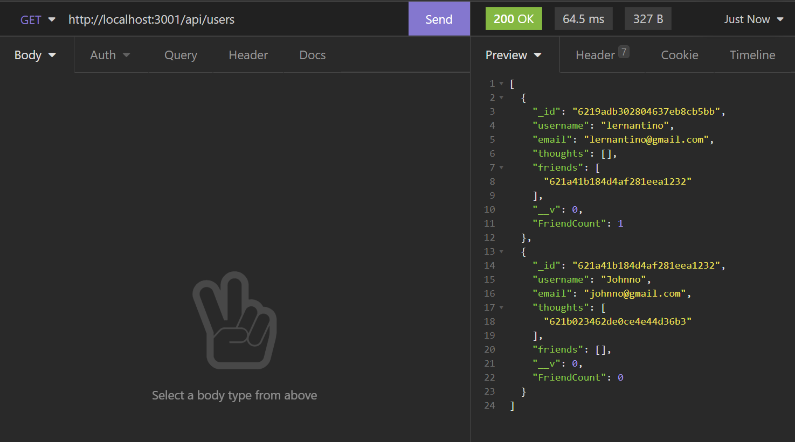

### /api/user POST

This route allows the creation of a user by handing a JSON object.
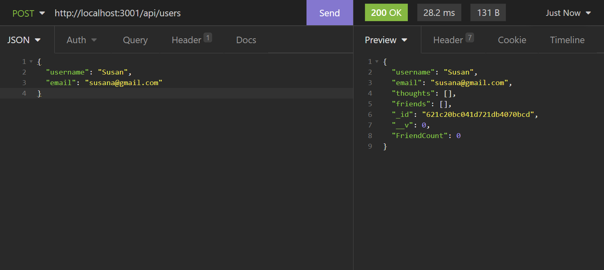

### /api/users/:userId GET

This route returns a single user with the corresponding ID.
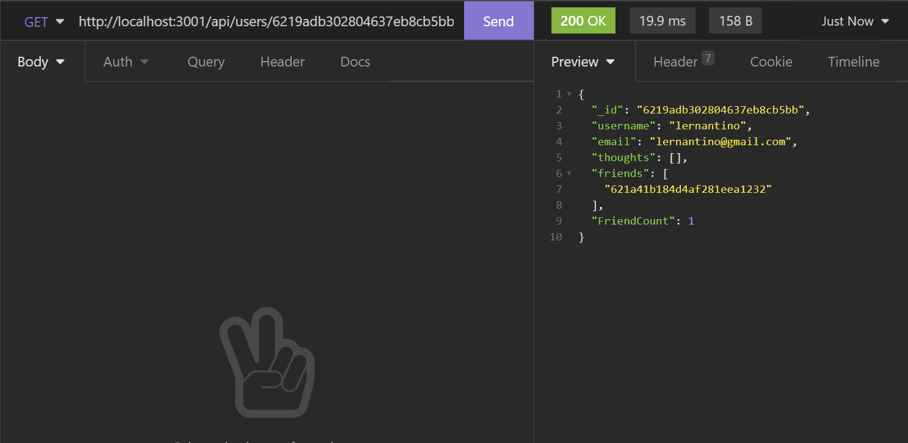

### /api/users/:userId PUT

This route updates an existing user's name or email by passing it as a JSON object.
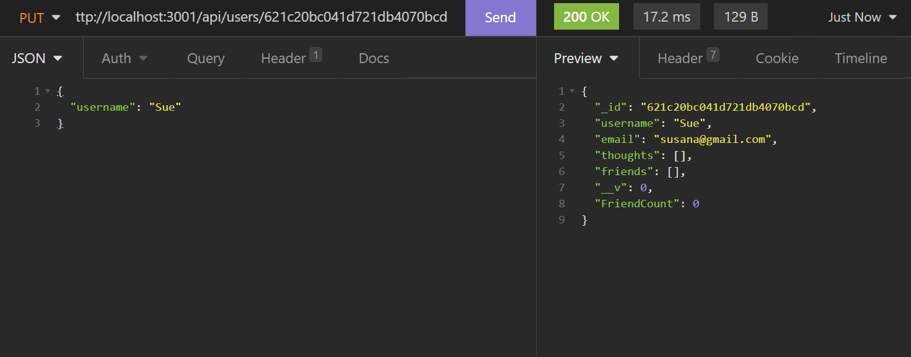

### /api/users/:userId DELETE

This route deletes an existing user with the corresponding ID
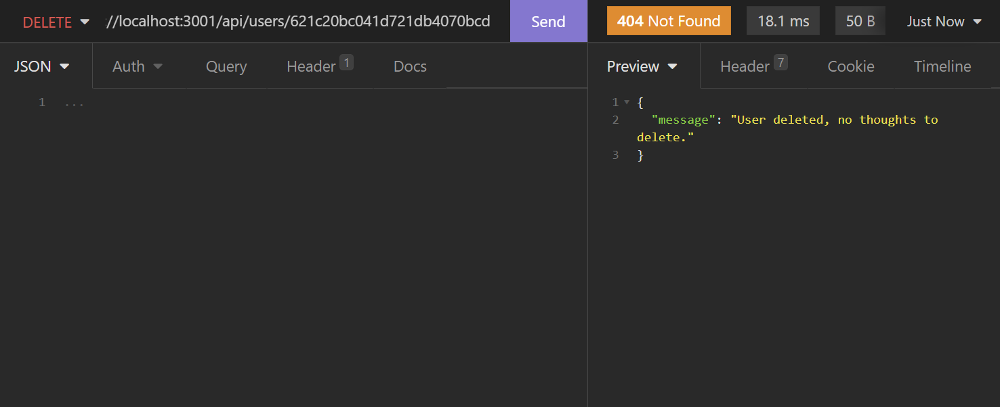

### /api/users/:userId/friends/:friendId POST

This route finds a user with the corresponding userID and addes another user with corresponding friendID to their "friends" array.
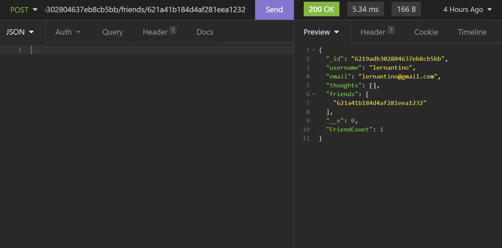
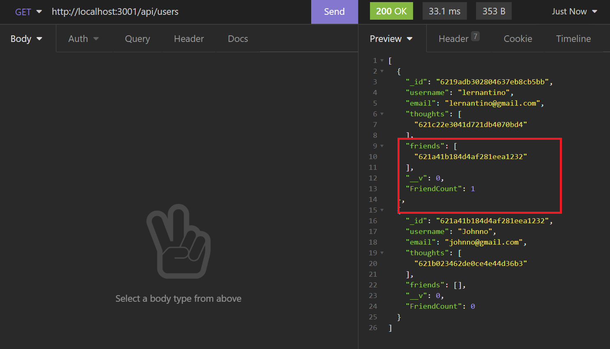

### /api/users/:userId/friends/:friendId DELETE

This route finds a user with the corresponding userID and removes the id in their friends array matching the friendId.
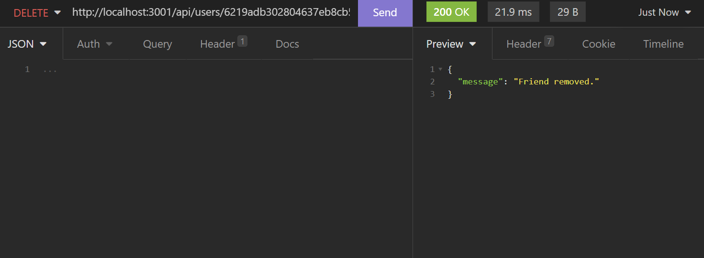

## Thought Routes

### /api/thoughts GET
This route returns all exisiting thoughts.
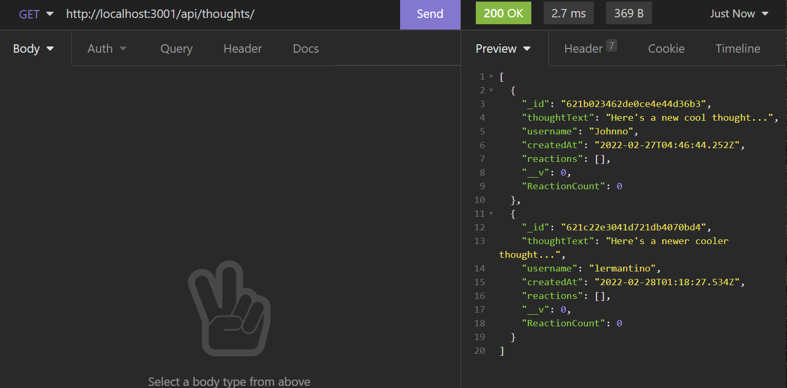

### /api/thoughts POST
This route creates a thought by sending the thoughtText, userID, and username as a JSON object.
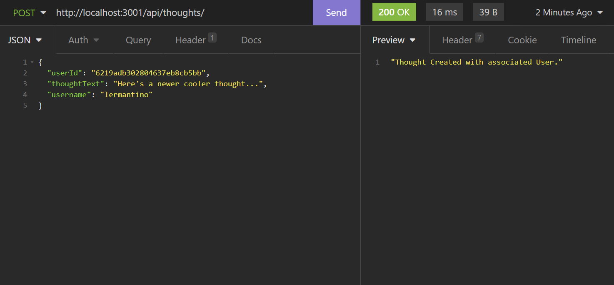

### /api/thoughts/:thoughtId GET
This route returns a single thought with the corresponding thoughtID.
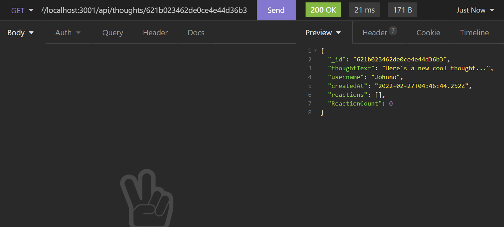

### /api/thoughts/:thoughtId PUT
This route updates a thought with the corresponding thoughtID by passing a JSON object with a new thoughtText value.
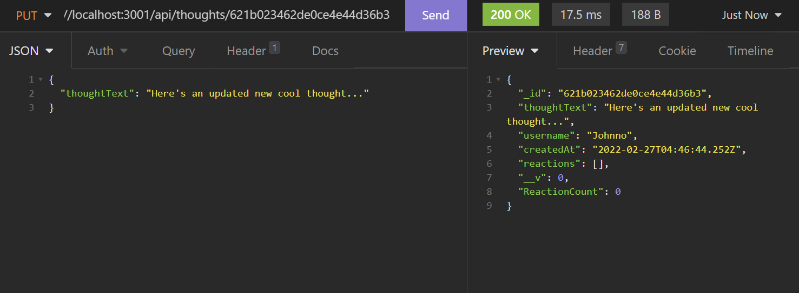

### /api/thoughts/:thoughtId DELETE
This route deletes a thought with the corresponding thoughtID.
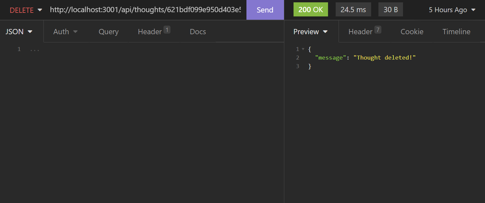

### /api/thoughts/:thoughtId/reactions POST
This route creates a new reaction to a thought with the corresponding thoughtID by passing a JSON object.
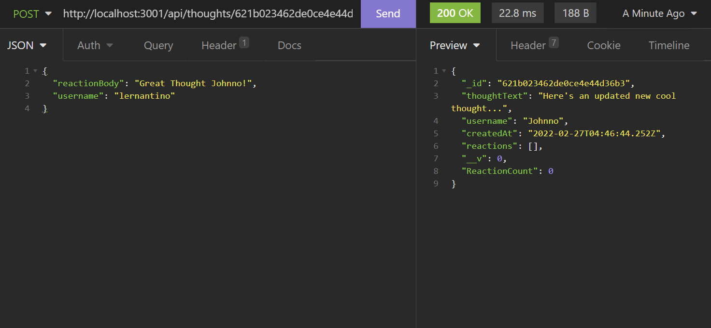
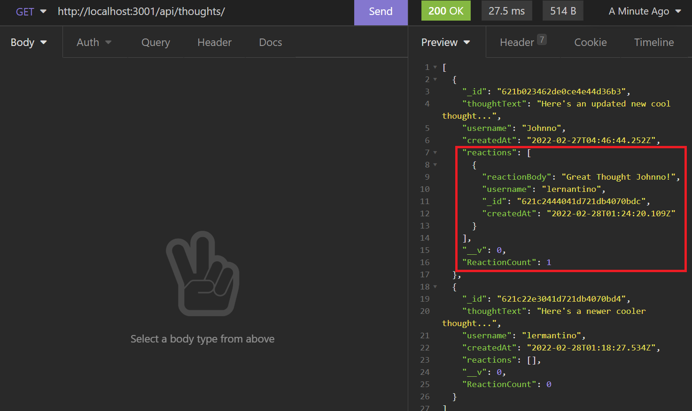

### /api/thoughts/:thoughtId/reactions/:reactionId
This route deletes a reaction to a post by targeting the corresponding thoughtId and then the corresponding reactionId
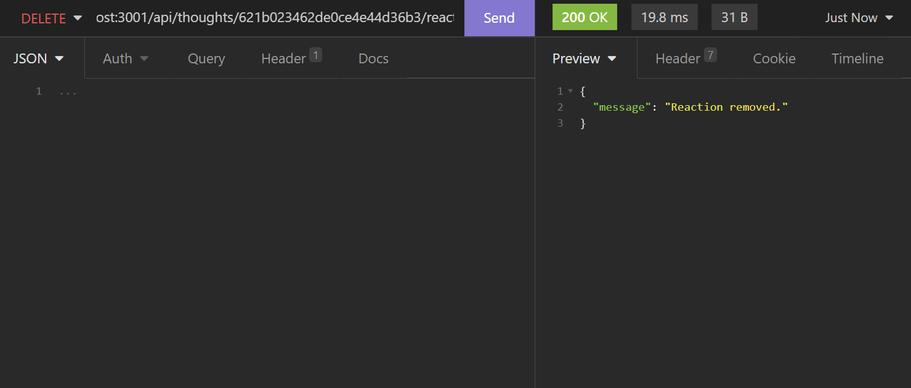

## Walkthrough Videos
Here's a link to the first walkthrough video: https://watch.screencastify.com/v/QxEEZpL3oL6DizWLhyrf

Link to Second Video: 
